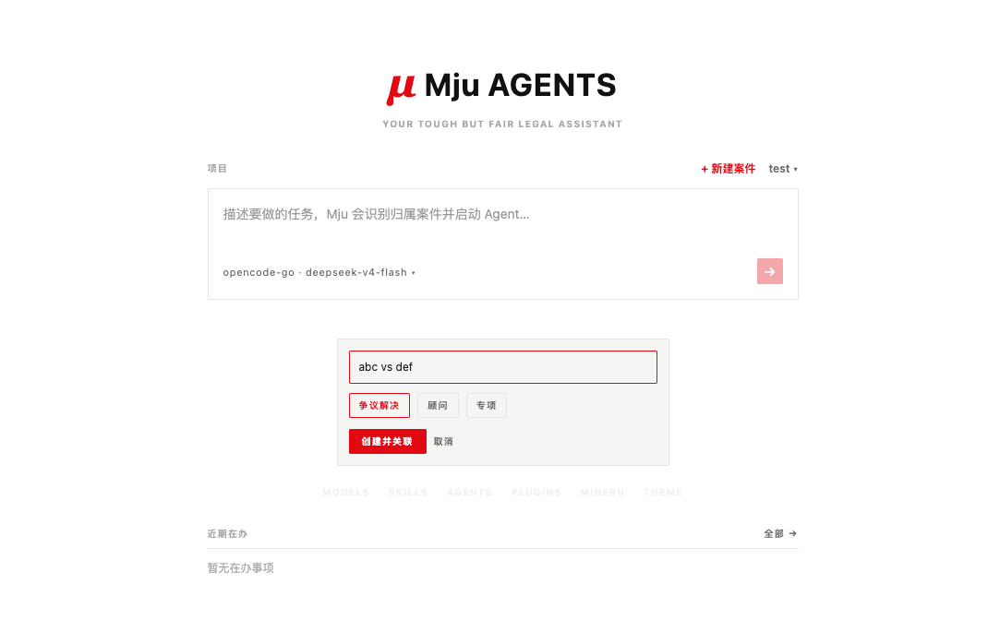
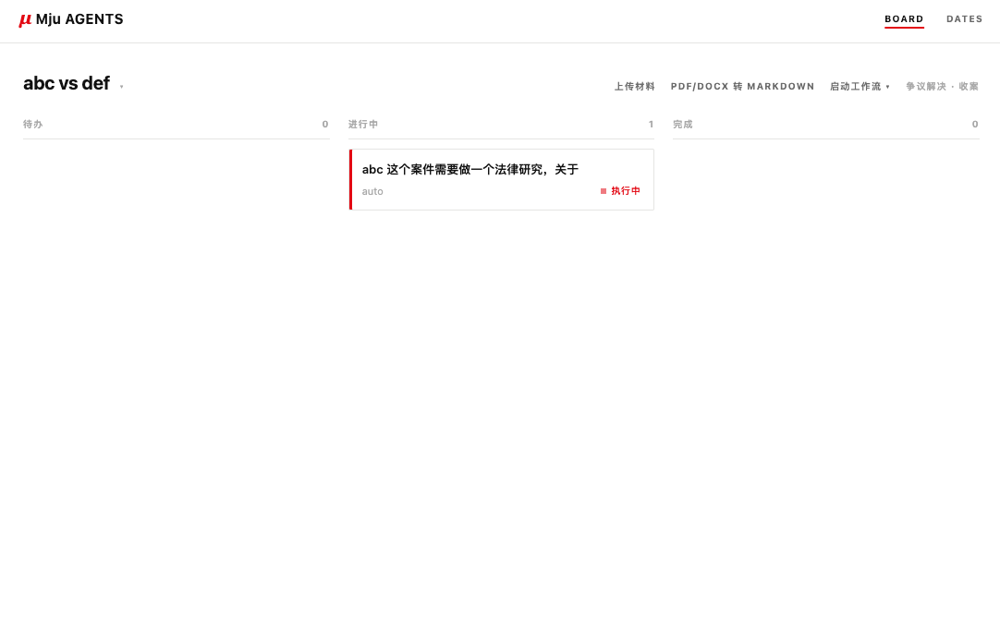

# Mju Agents

[npm](https://www.npmjs.com/package/@tttangerine/mju) · [许可证：MIT](./LICENSE) · [路线图](./docs/roadmap.md)

> 你的严格但公正的法律助手：从一句话开始，把经过复核的工作落到正确案件里。


<p align="center">
  
  
</p>

<p align="center">
  
  
</p>

截图使用完全虚构的案件和任务数据，不包含客户、案件或账户信息。

## 截图导览：从初始化到案件执行

下面这组截图对应一条完整的使用路径：先选择项目文件夹，再从一句话发起任务，让 Mju 识别案件归属，最后进入案件看板推进。

### 1. 初始化项目文件夹


首次进入 Mju 时，需要选择一个项目文件夹。这个文件夹可以是现有 Obsidian 文件库，也可以是一个空文件夹。

- 勾选「生成标准结构」后，Mju 会创建案件、任务、期限、日程等基础目录，便于后续按案件归档。
- 勾选「写入 Agent 指导文件」后，Mju 会在项目中写入 `AGENTS.md`，让 Agent 明确这个项目的案件结构和写作规则。
- 如果选择的是 Obsidian vault，Mju 会尽量识别既有 `ops/cases`、`ops/projects` 等目录，不要求你迁移到一个封闭数据库里。

### 2. 在进入页输入任务


初始化后会进入主输入页。这里不是普通聊天窗口，而是整个系统的入口。

- 在输入框里直接写要处理的事项，例如「这个案件需要做一个法律研究」。
- 右上角可以切换当前项目，也可以点击「新建案件」补建案卷。
- 输入框下方的 Models、Skills、Agents、Plugins、MinerU、Theme 是运行配置入口，用于切换模型、管理技能、配置子 Agent、配置插件和材料转换能力。
- 页面下方的「近期在办」用于聚合各案件即将跟进的事项。

### 3. 新建案件并选择类型


如果任务还没有对应案卷，可以在进入页直接新建案件。截图里的「abc vs def」是一个虚构案件名。

- 案件类型目前区分为争议解决、顾问、专项等，用来决定默认结构和后续工作流。
- 创建后，案件会进入当前项目的案件列表，后续任务可以直接归属到这个案件。
- 无法识别归属的任务会进入「通用任务」，避免任务丢失。

### 4. 识别案件归属并启动 Agent


当你输入任务时，Mju 会根据任务内容识别所属案件。截图中系统将任务识别到「abc vs def」。

- 如果识别正确，直接点击发送按钮即可启动。
- 如果识别错误，点击「更改」可以搜索并切换到正确案件。
- 启动后，Mju 会在该案件文件夹内开启 Agent 会话，并把原始指令保存为案件任务。

### 5. 在案件看板推进


任务启动后会进入案件看板。每个案件都有独立看板，用于管理待办、执行中和已完成事项。

- 正在运行的任务会出现在「进行中」列，并显示执行状态。
- 看板右上角集中放置案件动作：上传材料、PDF/DOCX 转 Markdown、启动工作流、争议解决收案。
- 材料上传和转换后，系统会把材料沉淀为 Markdown，便于 Agent 阅读、归档和后续复核。
- 任务完成后仍需要人工 Review；Mju 的定位是辅助形成工作成果，不替代律师判断。

## 为什么做 Mju

法律人不需要一个留满技术配置空间的工具。日常工作从哪里开始，Agent 就应该从哪里开始——而法律工作几乎总是从一句话开始：「帮我看看这个案子」「下周三要交答辩状」「约一下当事人」。

所以 Mju 只有一条主线：**你说一句话，它把这句话变成案件里的一件正事。**

几个贯穿始终的原则：

- **每段对话都有目的。** Mju 里的每次对话都落在某一个具体案件里，而不是悬空的闲聊——闲聊请去 ChatBot。案件是法律工作的天然容器：材料、文书、期限、日程、经验，全都应该收在案件里。
- **入口替你归位。** 输入指令时，Mju 会主动识别它属于哪个案件（识别错了随时可改），顺手把任务、日程、截止时间落下来，并在到期前提醒你。识别不了的先进「通用任务」收件箱，不会丢。
- **做完不等于完成。** 法律工作需要复核。Agent 产出的每件事都停在「待 Review」状态，由你过目后才算数。

## 从一句话到经你复核的工作

1. **从进入页开始。** 用日常语言描述事项；Mju 匹配所属案件（随时可改）、创建任务，并在该案件文件夹内启动 Agent。
2. **在案件看板推进。** 材料、任务、Agent 会话、期限和交付物始终绑定同一案件，不再散落在聊天标签和文件夹里。
3. **经复核才算完成。** 任务页保留 Agent 的工作过程和文档预览；专业判断与最终确认始终由你作出。

实际使用时，新工作区先从选择项目文件夹开始。Mju 可以自动生成标准案件结构，并写入项目级 `AGENTS.md` 指引。进入页支持直接新建案件、选择争议解决 / 顾问 / 专项等案件类型；输入任务时会识别所属案件，也可以手动更改归属后再启动。启动后，案件看板会把任务标记为执行中，并把上传材料、PDF/DOCX 转 Markdown、启动工作流、争议解决收案等操作放在同一案件视图里。

## 工作台结构

四个页面，就是上面这条主线的展开：

- **进入页（`/`）**——只有一个输入框。输入指令，自动识别归属案件，在该案件文件夹里启动 Agent 会话。输入框下方常驻「近期在办」，不用打字也能看到各案件即将到期的事项。
- **案件看板（`/board/[caseId]`）**——每个案件一个看板，回答两个问题：这个案子还有哪些待办？哪些做完了等我 Review？Agent 正在执行的任务卡片上有脉冲标记。
- **任务子页（`/task/[taskId]`）**——点开任务卡片进入执行现场：左栏是 Agent 的完整工作过程（流式输出、工具调用、分支、导出），右栏是它正在撰写的文档的实时预览，边看边 Review。复杂任务会自动分派给不同的子 Agent——不同模型各有所长，组成 Agent Team 既省 Token、提高命中率，也让产出更贴近各自的标准。
- **全局 Dates（`/dates`）**——跨案件聚合所有任务截止、诉讼期限和日程，列表 / 周 / 月三种视图，一眼看清近期要跟进什么。

## 快速开始

**免安装直接运行：**

```bash
npx @tttangerine/mju@latest
```

**或全局安装：**

```bash
npm install -g @tttangerine/mju
mju
```

然后打开 [http://localhost:30142](http://localhost:30142)。首次使用，在进入页指向任意文件夹即可：

- 如果指向 Obsidian 文件库，Mju 会自动扫描 `ops/cases/案卷`、`ops/projects/活跃项目` 等目录；
- 如果指向空文件夹，Mju 会自动生成标准项目结构、案件骨架、`AGENTS.md` 和内置 skills，直接上手。

**参数：**

```bash
mju --port 8080              # 自定义端口
mju --hostname 127.0.0.1     # 仅本机访问
mju --no-open                # 不自动打开浏览器
```

## 功能

- **案件优先，不是聊天优先**：每次 Agent 运行都绑定在案件看板的一个任务上，任务保存原始指令和会话 id。
- **完整对话在它该在的地方**：流式输出、工具调用详情、会话内分支、fork（自动回写任务绑定）、HTML 导出，都在任务子页。
- **Obsidian 是文件层**：案件就是文件库文件夹（初始化时自动扫描 `ops/cases/案卷`、`ops/projects/活跃项目`）；交付物以纯 markdown 写回，永远属于你。不用 Obsidian 也行，任何本地文件夹都能初始化。
- **Agent 团队**：可配置的子 Agent（默认 Justice / Magician / Chariot），各自独立的模型、工具和技能；遇到复杂任务运行时会自动分派。
- **材料自动化**：在案件看板上传材料，系统自动识别起诉状、判决书、合同等类型并归位，生成审阅任务和关键期限；配置 MinerU 后，PDF/DOCX 也能直接转成 Markdown 入库。
- **期限自动聚合**：任务截止、举证期限、开庭日程合并进同一个全局 Dates 视图，逾期标红。
- **瑞士风设计**：纸白 / 墨黑双主题，全场唯一的信号红点缀，没有多余装饰。
- **本地优先**：会话存在 `~/.pi/agent/sessions`，项目元数据存在 `~/.mju/projects`，数据不出本机。pi 运行时和 `pi-subagents` 已内置，无需单独安装 CLI。

它不是法律意见服务，也不替代专业复核。所有会话文件、案件元数据和凭证都留在你自己的机器上。

## 许可证与上游项目

Mju Agents 以 [MIT License](./LICENSE) 开源。项目最初基于同样采用 MIT 许可证的 [agegr/pi-web](https://github.com/agegr/pi-web) 衍生而来；其中法律工作流功能及后续修改由 Mju 独立维护。上游和内置运行时所需的归因均保留在 [NOTICE](./NOTICE)。Mju 与 agegr 或上游项目不存在隶属、合作或背书关系。

## 路线图

正在做的方向，都围绕同一个问题：让 Agent 越用越像你的同事。

- **记忆沉淀**：现在 Agent 在案件里工作，自然掌握了案件的全部上下文；缺的是对「你」的上下文——你的工作习惯、表达偏好、常用口径。未来会增加记忆系统，把这些沉淀下来。
- **经验复现**：重复做过几遍的工作流，Agent 会主动提示「要不要沉淀为技能」，一键生成可复用的 Skill，下次同类工作直接调用。

更远的规划见 [docs/roadmap.md](./docs/roadmap.md)。

## 说明

- **数据目录**：会话 `~/.pi/agent/sessions/<编码路径>/*.jsonl`；Mju 元数据 `~/.mju/projects/<编码路径>/store.json`。可用 `PI_CODING_AGENT_DIR` / `MJU_HOME` 改位置。
- **旧链接**：老的 `/sessions?session=<id>` 链接会自动重定向到所属任务（如果能找到的话）。
- **子 Agent**：见 [Subagents 文档](./docs/subagents.zh-CN.md)；**开源隐私边界**：见 [开源发布与隐私](./docs/open-source-release.zh-CN.md)。
- **架构**：[docs/architecture.md](./docs/architecture.md)。

## 开发

```bash
npm install
npm run dev    # http://localhost:30142
```

检查：`npm run typecheck`、`npm run lint`、`npm run test:backend`。开发时不要跑 `next build`。完整文件地图和设计决策见 [AGENTS.md](./AGENTS.md)。
